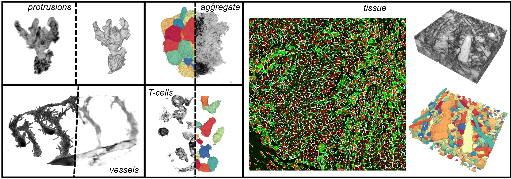
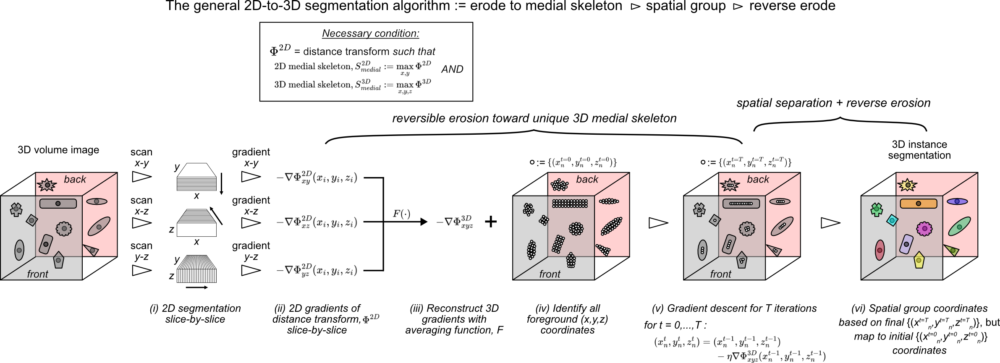
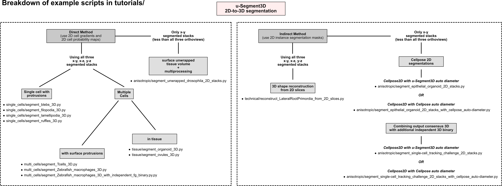
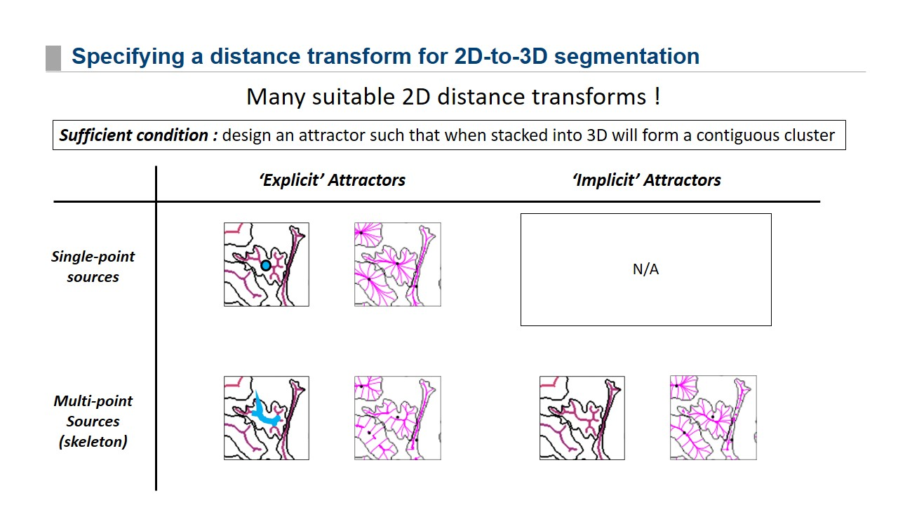
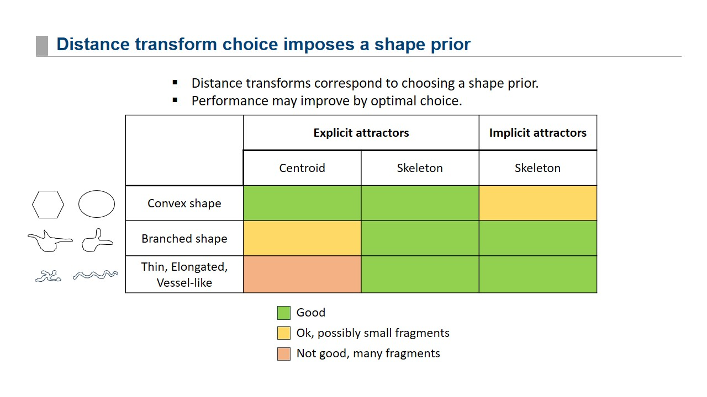

# u-Segment3D ("Turn 2D segmentations into 3D") 
## A Python library for generating 3D consensus cell segmentation from 2D segmented stacks

<p align="center">
  
</p>

<!-- TOC start -->
   * [Dependencies](#dependencies)
   * [Installation](#installation)
      + [Linux](#linux)
      + [Windows](#windows)
      + [MacOS](#macos)
   * [Getting Started](#getting-started)
      + [Direct Method (cell gradients and probability maps as input) in a nutshell](#direct-method-cell-gradients-and-probability-maps-as-input-in-a-nutshell)
      + [Indirect Method (instance segmentation masks as input) in a nutshell](#indirect-method-instance-segmentation-masks-as-input-in-a-nutshell)
      + [Choosing an Indirect Method Distance Transform](#choosing-an-indirect-method-distance-transform)
      + [Example Data](#example-data)
      + [Example Scripts](#example-scripts)
   * [Overview of Library Features](#overview-of-library-features)
   * [Questions and Issues](#questions-and-issues)
   * [Danuser Lab Links](#danuser-lab-links)
<!-- TOC end -->

#### June 2025
- we have updated API to add compatibility with Cellpose4 changes. u-Segment3D should work with cellpose>=4.0.5. If this is not available from pip, you will need to install the github version of cellpose: `pip install git+https://www.github.com/mouseland/cellpose.git`
- Note: In Cellpose4, the cellpose-SAM model ('cpsam') is the default. As of writing it seems 'cyto3', 'cyto2', 'cyto' etc. are no longer built-in. Therefore currently u-Segment3D will install as dependency **Cellpose3**. This will allow most flexibility for users.  

#### :star2: Mar 2025 :star2:
- u-Segment3D is available in PyPI and can be directly installed with `pip install u-Segment3D`

#### May 22, 2024
u-Segment3D is a Python library to merge 2D slice-by-slice segmented 3D volumes in x-y, x-z, or y-z views into a single consensus 3D segmentation. u-Segment3D can use the probabilities and gradients directly predicted by popular existing Neural Network segmentation models such as Cellpose (Direct Method) or operates on the provided 2D segmentations directly (Indirect Method). u-Segment3D does not require all 3 views, any number can be used, nor do each view need be generated by the same algorithm. u-Segment3D also provides a number of postprocessing algorithms to recover missing features after obtaining the 3D segmentation. Therefore it can also be used as a postprocessing module for 3D segmentations in general. 
Despite the name, the postprocessing and segmentation functions in u-Segment3D have 2D equivalents which can be used to enhance 2D segmentation too. Please see the tutorials.

The primary motivation in developing u-Segment3D is to take advantage and leverage existing state-of-the-art 2D segmentation models for 3D segmentation without further data training. 

It is associated with the BioArxiv paper, [**Universal consensus 3D segmentation of cells from 2D segmented stacks**](https://www.biorxiv.org/content/10.1101/2024.05.03.592249v3), *bioRxiv*, 2025, written by Felix Y. Zhou, Zach Marin, Clarence Yapp, Qiongjing Zhou, Benjamin A. Nanes, Stephan Daetwyler, Andrew R. Jamieson, Md Torikul Islam, Edward Jenkins, Gabriel M. Gihana, Jinlong Lin, Hazel M.Borges, Bo-Jui Chang, Andrew Weems, Sean J. Morrison, Peter K. Sorger, Reto Fiolka, Kevin Dean, and [Gaudenz Danuser](https://www.danuserlab-utsw.org/).

The current library is still a work-in-progress. It is fully functional but documentation still require work and more tutorials are upcoming. 

## A universal 2D-to-3D segmentation algorithm
<p align="center">
  
</p>

## Dependencies
u-Segment3D has a number of dependencies detailed in the requirements.txt. GPU dependencies are based on installing Cellpose to use as the default 2D segmentation method in u-Segment3D. 


## Installation
u-Segment3D can be installed for all three major OS from PyPI. We recommend installing to a new conda environment:
```
conda create -n u_Segment3D_env python=3.9
pip install u-Segment3D
```

u-Segment3D can also be installed by git cloning the repository and running pip in the cloned folder with python>=3.9. We have developed on Python==3.9 on Red Hat Enterprise Linux Server 7.9. `pyproject.toml` configures the individual dependencies for each OS.

### Linux
We suggest first creating a new conda environment for install and use conda to install cudatoolkit and cudnn first: 
```
conda create -n u_Segment3D_env python=3.9 cudatoolkit=11.8.* cudnn==8.* -c anaconda
conda activate u_Segment3D_env
pip install .
```
If on a HPC cluster, depending on the way it is setup, you may need to module load the cuda corresponding to the install, `module load cuda118/toolkit/11.8.0` prior to activating the conda environment to use the installed `cupy` library functions for image resizing. Otherwise, u-Segment3D will fall back to a `pytorch` version of image resizing. Don't worry, this still uses gpu, but is slower than using cupy.

**Errors we have encountered:**

1. When running, we get an `icu` error, `AttributeError: module 'icu' has no attribute 'Locale'`. Fix this by installing `pyicu`. This can be done using pip (requires gcc compiler, gcc>=6.3.0) or alternatively installation of a precompiled version with conda from the conda-forge channel
```
pip install pyicu # Requires compilation, check that gcc>=6.3.0 to be available on your linux distribution
conda install -n u_Segment3D_env pyicu -c conda-forge # tries to install a precompiled version. 
```

2. pytorch does not have gpu available. Try installing a previous version for the respective cudatoolkit version. Alternatively, try installing a precompiled version using anaconda from the conda-forge channel. Refer to instructions for Windows below.  

3. You see a print out along the lines of 'cuda not available. Falling back to pytorch'. This doesn't mean you don't have cuda. It means cuda drivers is likely installed in non-standard location or not installed properly so that not all cupy function is not available. Consequently u-Segment3D is using CUDA (if available) via pytorch. 

### Windows
```
conda create -n u_Segment3D_env python=3.9 cudatoolkit=11.8.* cudnn==8.* -c anaconda
conda activate u_Segment3D_env
pip install .
```
On machine with NVIDIA graphics card, check to see if torch has been correctly installed with GPU by importing the library in Python. 
```
import torch
print(torch.cuda.is_available())
```
If `True`, nothing needs to be done, you are set. If `False`, you need to install an earlier version of pytorch compiled for cuda11.8
```
pip install torch==2.0.1 --index-url https://download.pytorch.org/whl/cu118
```
See https://pytorch.org/get-started/previous-versions/ to check out other pytorch versions.

Alternatively, you may try to install pytorch through anaconda from the conda-forge channel:
```
conda install pytorch torchvision torchaudio pytorch-cuda=11.8 -c pytorch -c nvidia
```

**Errors we have encountered:**

1. Installing `scikit-fmm` fails, because it cannot be compiled. To resolve, install precompiled binary version through `conda-forge` before running `pip install .`
```
conda install -n u_Segment3D_env scikit-fmm -c conda-forge
```

### MacOS
NVIDIA CUDA is not available for MacOS with Apple Silicon chips. Therefore don't install any of these dependencies.
```
conda create -n u_Segment3D_env python=3.9
conda activate u_Segment3D_env
pip install .
```

## Getting Started
The simplest way to get started is to check out the included notebook tutorials which aims to showcase various use cases of u-Segment3D for 3D segmentation and how parameters may be tuned and algorithms adapted. A pictorial diagram is provided to show how tutorial scripts relate:
<p align="center">
  
</p>

#### Direct Method (cell gradients and probability maps as input) in a nutshell
If you have computed 2D slice-by-slice instance cell segmentations in xy, xz, and yz views, represented by their unit-length gradients  and a 0-1 normalized cell probability maps then you can translate these into one 3D instance segmentation mask with a few lines of code:
```
import segment3D.parameters as uSegment3D_params
import segment3D.usegment3d as uSegment3D

# instantiate default parameters
aggregation_params = uSegment3D_params.get_2D_to_3D_aggregation_params()

# integrate labels_xy, labels_xz, labels_yz into one single 3D segmentation. Give a single-channel volume image, img we define its xy view as img, its xz view as img.transpose(1,2,0) and its yz view as img.transpose(2,0,1)
segmentation3D, (probability3D, gradients3D) = uSegment3D.aggregate_2D_to_3D_segmentation_direct_method(segmentations=[img_segment_2D_xy_probs,
                                                                                                                          img_segment_2D_xz_probs,
                                                                                                                           img_segment_2D_yz_probs], 
                                                                                                                  gradients =   [img_segment_2D_xy_flows, 
                                                                                                                   img_segment_2D_xz_flows,
                                                                                                                    img_segment_2D_yz_flows], 
                                                                                                                   params=aggregation_params,
                                                                                                                savefolder=None,
                                                                                                                basename=None)
``` 

#### Indirect Method (instance segmentation masks as input) in a nutshell
The easiest way to use u-Segment3D is the indirect method. If you have 2D slice-by-slice instance segmentation masks of cells in xy, xz, and yz views, then you can translate these into one 3D instance segmentation mask with a few lines of code:
```
import segment3D.parameters as uSegment3D_params
import segment3D.usegment3d as uSegment3D

# instantiate default parameters
indirect_aggregation_params = uSegment3D_params.get_2D_to_3D_aggregation_params()

# integrate labels_xy, labels_xz, labels_yz into one single 3D segmentation. Give a single-channel volume image, img we define its xy view as img, its xz view as img.transpose(1,2,0) and its yz view as img.transpose(2,0,1)
segmentation3D, (probability3D, gradients3D) = uSegment3D.aggregate_2D_to_3D_segmentation_indirect_method(segmentations=[labels_xy,
                                                                                                                        labels_xz,
                                                                                                                        labels_yz], 
                                                                                                                  img_xy_shape = labels_xy.shape, 
                                                                                                                precomputed_binary=None, 
                                                                                                                params=indirect_aggregation_params,
                                                                                                                savefolder=None,
                                                                                                                basename=None)
``` 

**NOTE: for both direct and indirect method above, you can use the empty list `[]` if you do not have segmentation or gradients in one or more orthoviews. This is how u-Segment3D permits 3D translation from any combination of orthoviews**

#### Choosing an Indirect Method Distance Transform
Choosing a distance transform is a tradeoff for computational speed and accuracy. u-Segment3D provides distance transforms which specify a medial-axis skeleton implicitly and explicitly. If you have tubular, skeletal data, the implicit Euclidean Distance Transform works well. If you have convex cells, the explicit point-source transform, primarily the heat diffusion used also by Cellpose is good. For mixture of arbitrary morphologies, the explicit skeletal point-set transform is best, where u-Segment3D first estimates the medial-axis skeleton with binary morphological operations, then solves the heat diffusion equation using the skeletal points as sources.

The distance transform types available in u-Segmented are summarized visually in the figure.
<p align="center">
  
</p>
<p align="center">
  
</p>

The distance transforms are specified by modifying the default parameters imported from parameters.py
```
import segment3D.parameters as uSegment3D_params

# Get the default parameters. 
indirect_aggregation_params = uSegment3D_params.get_2D_to_3D_aggregation_params()

"""
# a) using Explicit Point Source Distance transforms (either heat diffusion or geodesic)
"""
indirect_aggregation_params['indirect_method']['dtform_method'] = 'cellpose_improve' # exact version of Cellpose's iterative heat diffusion
indirect_aggregation_params['indirect_method']['dtform_method'] = 'fmm' # Fast marching solved geodesic variant 
indirect_aggregation_params['indirect_method']['edt_fixed_point_percentile'] = 0.01 # adjustment of where to place the medial centroid point. The higher this is, the more the centroid is sampled from only the ridges of the Euclidean Distance Transform. 
    
"""
# b) 
"""
# 1. uses heat diffusion skeleton
indirect_aggregation_params['indirect_method']['dtform_method'] = 'cellpose_skel' 
# 2. uses Fast marching method solved geodesic skeleton
indirect_aggregation_params['indirect_method']['dtform_method'] = 'fmm_skel' 

# For both, medial-axis skeleton is found by skimage.morphology.skeletonize. This can result in skeletons with erroneous or too much bifurcations. The following parameters control the smoothing of the skeleton by Gaussian filtering then rebinarizing with a threshold
indirect_aggregation_params['indirect_method']['smooth_skel_sigma'] = 1 
indirect_aggregation_params['gradient_descent']['gradient_decay'] = 0.25

"""
# c) Implicit Skeletal Distance Transform (Euclidean Distance Transform)
"""
indirect_aggregation_params['indirect_method']['dtform_method'] = 'edt' # Uses edt package (https://pypi.org/project/edt/) for fast evaluation. 
    
"""
The distance transforms can be further adjusted by modifying gradient decay rate.
"""
indirect_aggregation_params['gradient_descent']['gradient_decay'] = 0.25
    
```

### Example Data
Please download the zipped folder containing example data from the [link](https://www.dropbox.com/scl/fo/le8rjbrohg9p29kebq25f/ANp7T7Z7bh4GsaphRmp7Qc0?rlkey=prgj9mxlluy8cl7x68ygtrigz&st=x89yerip&dl=0). The following examples assume you have unzipped the data to the `example_data/` directory of this repository, and is running the examples after installation from their current location in the repository. Please adjust filepaths accordingly, if otherwise. 

### Example Scripts
**Examples for 3D Single Cell segmentation with morphological motifs:**
1. tutorials/single_cells/segment_blebs_3D.py : "demonstrates direct method, how to run on downsampled version to get base segmentation, and additionally recover cellular protrusions at original image resolution for efficiency"
2. tutorials/single_cells/segment_lamellipodia_3D.py : "demonstrate direct method and basic usage"
3. tutorials/single_cells/segment_filopodia_3D.py : "demonstrates direct method and basic usage, and using a median filter to pre-smooth salt-and-pepper like noise which may affect guided filter postprocessing"
4. tutorials/single_cells/segment_ruffles_3D.py : "demonstrates direct method and basic usage, and extra use of padding and median filter, if single cells are cropped too close to the border"

**Examples for 3D Multiple Cell segmentation:**
1. tutorials/multi_cells/segment_Tcells_3D.py : "demonstrates the same direct method with Cellpose backend for single cells can be applied to resolve multiple cells and their subcellular protrusions"
2. tutorials/multi_cells/segment_zebrafish_macrophages_3D.py : "demonstrates more extensive preprocessing prior to running Cellpose 2D and then running u-Segment3D aggregation"
3. tutorials/multi_cells/segment_zebrafish_macrophages_3D_with_independent_fg_binary.py : "demonstrates how to 'paint' an external binary with cellpose gradients within the gradient descent aggregation in u-Segment3D. Regions not covered by gradients are segmented as a single cell or fragment"

**Examples for 3D Tissue segmentation:**
1. tutorials/tissue/segment_organoid_3D.py : "demonstrate direct method and basic usage, with minimal processing, how to resize images according to voxel resolution and eval performance"
1. tutorials/tissue/segment_ovules_3D.py : "demonstrate direct method and basic usage, with minimal processing, how to resize images according to voxel resolution and eval performance"

**Examples for 2D segmentation for anisotropic:**
These examples demonstrate the indirect method, whereby we first generate the 2D segmentation masks and also showcases how to aggregate on only one view i.e. 'xy' to segment 3D.  
1. tutorials/anisotropic/segment_single-cell_tracking_challenge_2D_stacks.py : "demo segmentation of MDA231 cells from the single cell tracking challenge, using an independent Otsu thresholded foreground binary to mask and get cell shape boundary"
2. tutorials/anisotropic/segment_epithelial_organoid_2D_stacks.py : "demo segmentation of an air-liquid interface grown skin cell culture that is thin"


## Overview of Library Features
For those interested, u-Segment3D is a library organized by function similar to scipy / numpy / opencv allowing re-usable functions that can be used to build-up complex processing pipelines. A brief summary is below. 

|Module                   |Functionality|
|-------------------------|-------------|
|file_io.py               | Functions for reading and writing images and intermediate outputs including pickled objects|
|filters.py               | Functions for 'filtering', 'enhancing' and 'cleaning-up' images and segmentations e.g. label diffusion, keep largest component |
|flows.py                 | Functions for computing different 2D flows used for 2D-to-3D segmentation|
|gpu.py                   | Functions for GPU-based processing, primarily array resizing to speed up I/O operations if GPU is available and CUDA is installed.|
|meshtools.py             | Functions for basic mesh processing, e.g. reading/writing meshes, extracting surface mesh from binary segmentation and computing mesh properties|
|metrics.py               | Functions for evaluating segmentation performance, such as average precision|
|parameters.py            | Functions for generating the default parameters for key u-Segment3D steps|
|plotting.py              | Functions for plotting, such as coloring the gradient and segmentations |
|segmentation.py          | Functions for running Cellpose with automatic parameter tuning |
|watershed.py             | Functions for doing suppressed gradient descent in  2D/3D|
|usegment3d.py            | Wrapper Functions that align with the conceptual steps in the paper - most often will use functions from here|


## Questions and Issues
Feel free to open a GitHub issue or email me at felixzhou1@gmail.com.

## Danuser Lab Links
[Danuser Lab Website](https://www.danuserlab-utsw.org/)

[Software Links](https://github.com/DanuserLab/)
